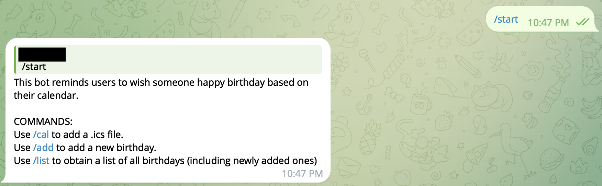
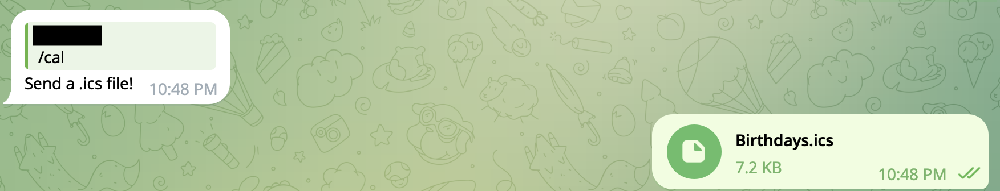

# Telegram Birthday Bot
## Description
A simple telegram bot that notifies users about birthdays based on calendar uploaded.

It is recommended to follow [usage instructions](#Usage) because this bot is being hosted on Render free plan which might not respond immediately.

## Technologies Used
- Python
- Telegram API
## Commands
### /start
- Introduction to this bot
    - Purpose
    - Usage of commands

### /cal
- Upload a .ics file to telegram after the prompt

### /add
- Send a message in the format of MM/DD after the prompt

### /list
- Obtain a list of all birthdays in the uploaded calendar, as well as those added using /add
- If this command is used before /cal, an error message will be sent

## Usage 
- Run bot.py locally
- Access via https://t.me/bday_notification_bot 

## Possible Updates 
- [ ] Return updated calendar file to user
- [ ] Allow bot to remember chat history across sessions (Currently, bot.py has to be constantly running for bot to work)
